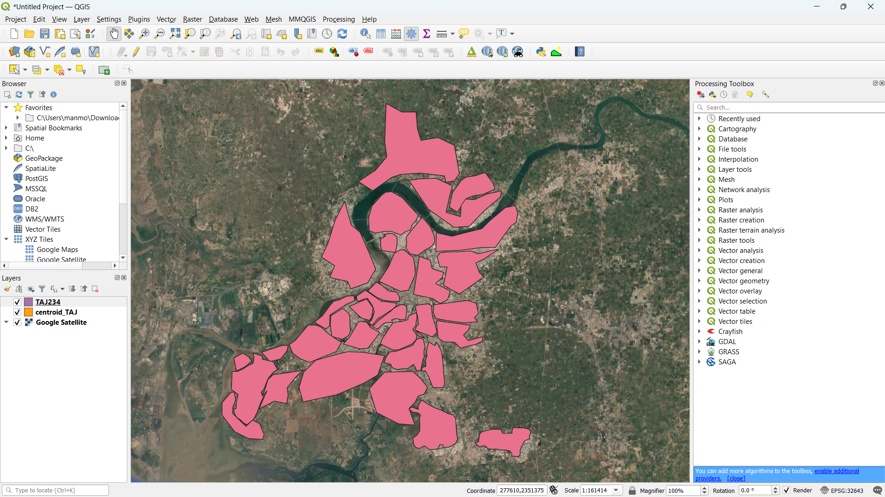
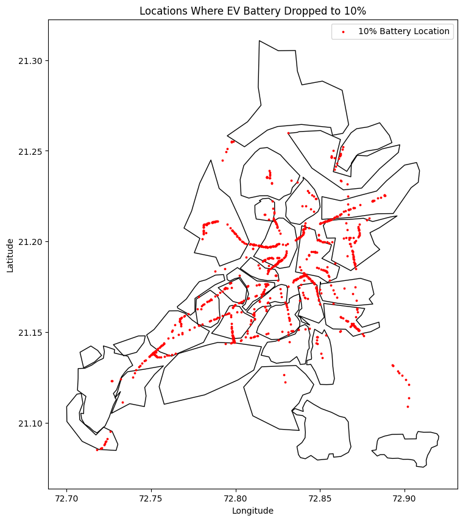
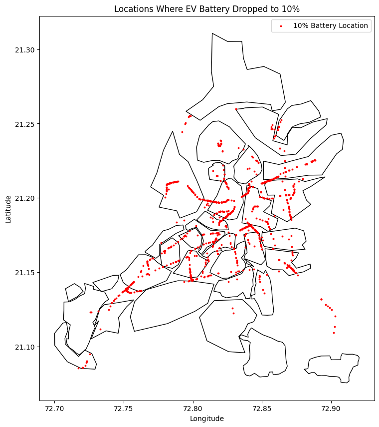
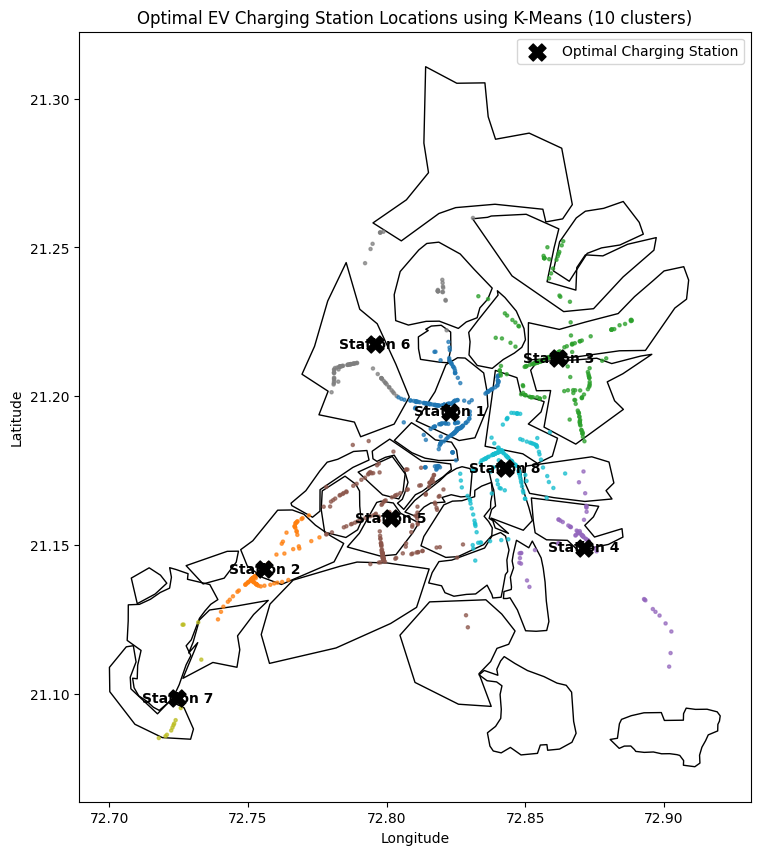
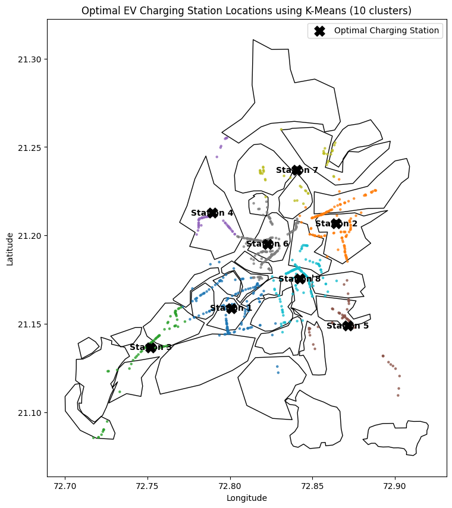
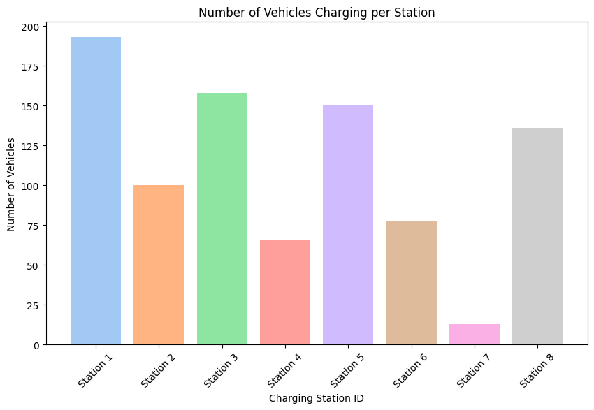
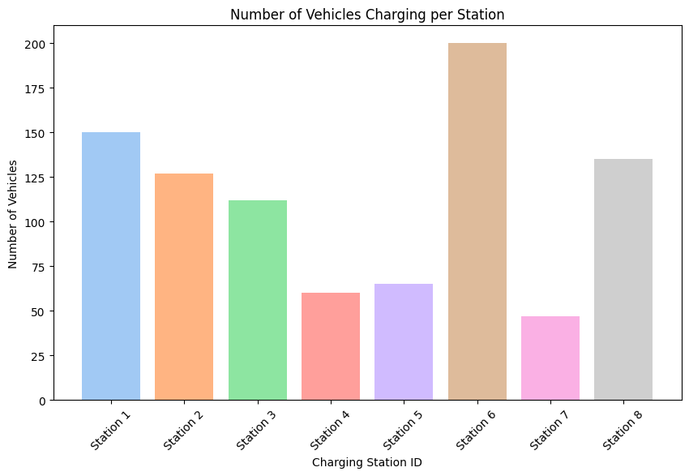

# SUMO EV Charging & Battery Simulation

This project focuses on modelling and optimizing Electric Vehicle (EV) charging infrastructure for Surat city using microscopic traffic simulation. The workflow integrates transportation demand modelling, GIS analysis, clustering algorithms, and SUMO-based EV simulations to identify optimal charging station locations.

The main objective is to:

- Analyze EV travel demand using Origin–Destination (OD) matrices.
- Simulate EV battery behaviour in realistic traffic conditions.
- Identify locations where EV batteries frequently drop below critical levels.
- Apply clustering techniques to determine optimal charging station placement.
- Validate charging infrastructure effectiveness through simulation.

---

## Quick summary

- Use `create_sumo_config.py` to build a SUMO configuration file combining a network, routes, and additional files.
- Use `place_chargers.py` to convert lon/lat charger points into a SUMO `*.add.xml` file (nearest-lane placement).
- Use SUMO (GUI or headless) to run the simulation and `app.py` (TraCI) to record vehicles that drop below a battery threshold.

---

## Core concept

This project demonstrates a reproducible workflow to study where and why electric vehicles run low on battery, and how charger placement changes outcomes. The core ideas:

- Simulate EV trips on a realistic road network with SUMO and route files.
- Model battery state for vehicles using SUMO's device/battery extensions (via `*.add.xml` files).
- Place charging stations on lanes (automatically or manually) and include them in the simulation configuration.
- Detect low-battery events either from SUMO outputs or in real time with TraCI (see `app.py`).
- Produce visual and numerical summaries (CSV and PNG outputs) to compare scenarios such as optimized vs unoptimized charger placement.

This setup supports iterative experiments: change routes, adjust charger locations, re-run simulations, and compare discharge/clustering metrics.

---

## Study Area
The study focuses on Surat city, India
Inputs include:
  - Land-use dattaser
  - TAZ boundaries
  - Population and employement data
  - Road network converter to SUMO formate
### Example TAZ visualization:

  - Traffic Analysis Zones (TAZ) / landuse used in spatial analysis:
  

- High-resolution landuse raster used for planning (GeoTIFF):

`Images/landuse_surat_modified.tif`

- Discharge — Optimized scenario:



- Discharge — Unoptimized scenario:



- Cluster of low-battery points — Optimized:



- Cluster of low-battery points — Unoptimized:



- Cluster load comparison — Optimized:



- Cluster load comparison — Unoptimized:




---

## Files of interest

- **Network & routes**
  - `2345net.net.xml` — SUMO network in this folder.
  - Route files: any `routes_*.rou.xml` files in the repo.

- **Helper scripts**
  - `create_sumo_config.py` — builds `simulation_with_charging.sumo.cfg` from `net`, `route`, and `additional` files.
  - `place_chargers.py` — places chargers (lon/lat list) onto the network and writes `chargingStations_generated.add.xml`.
  - `app.py` — connects to SUMO via TraCI and records vehicles with battery < 10% into `discharged_battries_optimized.csv`.

- **Add/Output files**
  - `battery_devices_*.add.xml` — battery/device definitions for vehicles.
  - `chargingStations_generated.add.xml`, `chargingStations_location.xml` — charger definition files.
  - `Discharged_EVs.xml`, `battery_output*.xml` — example outputs from SUMO.

---

## Requirements / Prerequisites

- SUMO (latest stable recommended) installed and on your PATH (`sumo` and `sumo-gui` accessible).
- Python 3.8+.
- Python packages (example):

```bash
pip install sumolib traci pandas lxml
```

---

## Typical workflow / usage

1. Prepare or edit input files: network (`*.net.xml`), routes (`*.rou.xml`), device/add files.
2. (Optional) Generate a config:

```bash
python create_sumo_config.py
```

3. (Optional) Generate charging stations from lon/lat:

```bash
python place_chargers.py
```

4. Run SUMO with the config:

```bash
sumo-gui -c simulation_with_charging.sumo.cfg
# or headless:
# sumo -c simulation_with_charging.sumo.cfg
```

5. Run `app.py` to record low-battery vehicles via TraCI:

```bash
python app.py
```

Output CSVs and PNGs will be written to the repository (see `images/` and `*.csv`).

---

## Notes & troubleshooting

- `app.py` expects the vehicle/device definitions to expose `device.battery.actualBatteryCapacity` and `device.battery.maximumBatteryCapacity` via TraCI.
- `place_chargers.py` assumes the network uses lon/lat; convert coordinates if your net uses projected coords.
- If `app.py` fails to start SUMO, verify the config filename inside `app.py` and ensure the file exists.

---

## Next steps I can do for you

- Update `app.py` to point to `simulation_with_charging.sumo.cfg` (or another config you pick).
- Add a `requirements.txt` and a small CLI script to run the full pipeline.
- Produce a short notebook that loads `discharged_battries_optimized.csv` and renders the figures shown in `images/`.

If you want any of these, tell me which to do next.
